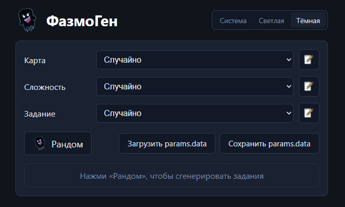

# PhasmophobiaChallengeRandom

Простой раздомайзер челенджей для Phasmophobia (Vue 3 + Vite).

Позволяет разнообразить игру
* случайная карта
* случайная сложность
* случайное испытание

### Исправления
* Добавлена поддержка тем [18.08.2026]

Наборы карт, сложности и испытаний можно редактировать.




## Как начать пользоваться
* Скачайте файл из раздела Releases
* Откройте скаченный index.html

## Запуск

```sh
npm install
npm run dev
```

Сборка для продакшна: `npm run build` (результат в `dist/`).

## Формат файла params.data

Списки импортируются/экспортируются кнопками вниз панели. Формат совместим с оригинальным приложением:

```json
{"Difficulty":[],"Maps":[],"Challenge":[]}
```

Дополнительно списки автосохраняются в localStorage браузера, поэтому правки не теряются между сессиями.